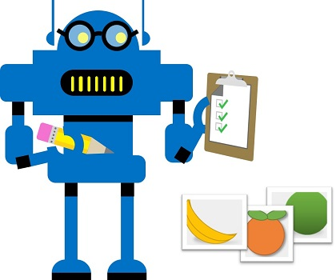
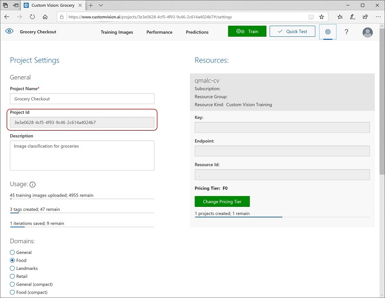

<div id="readme" class="Box-body readme blob js-code-block-container p-5 p-xl-6 gist-border-0" dir="rtl">
    <article class="markdown-body entry-content container-lg" itemprop="text"><h1><a id="user-content-تصنيف-الصورة" class="anchor" aria-hidden="true" href="#تصنيف-الصورة"><svg class="octicon octicon-link" viewBox="0 0 16 16" version="1.1" width="16" height="16" aria-hidden="true"><path fill-rule="evenodd" d="M7.775 3.275a.75.75 0 001.06 1.06l1.25-1.25a2 2 0 112.83 2.83l-2.5 2.5a2 2 0 01-2.83 0 .75.75 0 00-1.06 1.06 3.5 3.5 0 004.95 0l2.5-2.5a3.5 3.5 0 00-4.95-4.95l-1.25 1.25zm-4.69 9.64a2 2 0 010-2.83l2.5-2.5a2 2 0 012.83 0 .75.75 0 001.06-1.06 3.5 3.5 0 00-4.95 0l-2.5 2.5a3.5 3.5 0 004.95 4.95l1.25-1.25a.75.75 0 00-1.06-1.06l-1.25 1.25a2 2 0 01-2.83 0z"></path></svg></a>تصنيف الصورة</h1>

توفر خدمة *الرؤية الحاسوبية* المعرفية نماذج مفيدة مثبتة مسبقًا للعمل مع الصور، ولكنك ستحتاج غالبًا إلى تدريب نموذجك الخاص على الرؤية الخاصة بالحاسوب. على سبيل المثال، لنفترض أن شركة البيع بالتجزئة Northwind Traders تريد إنشاء نظام دفع آلي يحدد عناصر البقالة التي يرغب العملاء في شرائها استنادًا إلى صورة التقطتها الكاميرا عند الخروج. للقيام بذلك، ستحتاج إلى تدريب نموذج تصنيف يمكنه تصنيف الصور لتحديد العنصر الذي يتم شراؤه.



في Azure، يمكنك استخدام خدمة ***الرؤية المعدلة*** المعرفية لتدريب نموذج تصنيف الصور استنادًا إلى الصور الموجودة. ثمة عنصران لإنشاء برنامج تصنيف الصور. أولًا، يجب تدريب نموذج للتعرف على الفئات المختلفة باستخدام الصور الموجودة. بعد ذلك، عندما يتم تدريب النموذج، يجب عليك نشره كخدمة يمكن استخدامها من قبل التطبيقات.

## إنشاء مورد رؤية معدلة

لاستخدام خدمة رؤية معدلة، تحتاج إلى مورد Azure يمكنك استخدامه *لتدريب* نموذج، ومورد يمكنك *نشره* لتستخدمه التطبيقات. يمكن أن يكون المورد لأي من المهمتين (أو لكليهما) مورد **خدمات معرفية** عام، أو مورد **رؤية معدلة** محدد. يمكنك استخدام نفس مورد الخدمات المعرفية لكل مهمة من هذه المهام، أو يمكنك استخدام موارد مختلفة (في نفس المنطقة) لكل مهمة لإدارة التكاليف بشكل منفصل.

استخدم الأمر التالي لإنشاء مورد **رؤية معدلة** جديدة:

1. في مستعرضٍ جديدٍ، افتح مدخل Azure على [https://portal.azure.com](https://portal.azure.com)، وقم بتسجيل الدخول باستخدام حساب Microsoft المرتبط باشتراك Azure الخاص بك.
2. اضغط على زر **&#65291; إنشاء مورد**، ابحث عن *رؤية معدلة، *وأنشئ مورد **رؤية معدلة** بالإعدادات التالية:
    - **إنشاء الخيارات**: كلاهما
    - **الاشتراك**: *اشتراكك في Azure*
    - **مجموعة الموارد**: *حدد أو أنشئ مجموعة موارد باسمٍ فريدٍ*
    - **الاسم**: *أدخل اسمًا فريدًا*.
    - **موقع التدريب**: *اختر أي منطقة متوفرة*
    - **مستوى أسعار التدريب:** F0
    - **موقع التنبؤ:** *نفس المنطقة التي يوجد بها مورد التدريب*
    - **مستوى أسعار التنبؤ:** F0

    >**ملاحظة**: إذا كانت لديك خدمة رؤية معدلة F0 في اشتراكك مسبقًا، فاختر **S0 ** لأجل هذا.

3. انتظر حتى يتم إنشاء الموارد، ولاحظ أنه يتم توفير اثنين من موارد الرؤية المعدلة، بحيث يكون ثمة واحد للتدريب والآخر للتنبؤ. يمكنك عرض هذا من خلال الانتقال إلى مجموعة الموارد حيث قمت بإنشائها.

## قم بإنشاء مشروع رؤية مخصصة

لتدريب نموذج الكشف عن الأشياء، تحتاج إلى إنشاء مشروع رؤية معدلة بناءً على مورد التدريب الخاص بك. للقيام بذلك، ستستخدم منصة الرؤية المعدلة Custom Vision.

1. قم بتنزيل واستخراج صور التدريب من https://aka.ms/fruit-images.
2. في علامة تبويب مستعرض أخرى، افتح مدخل رؤية معدلة على [https://customvision.ai.](https://customvision.ai) إذا طُلب منك ذلك، قم بتسجيل الدخول باستخدام حساب Microsoft المرتبط باشتراك Azure الخاص بك، ووافق على شروط الخدمة.
3. في مدخل الرؤية المعدلة، قم بإنشاء مشروع جديد عبر الإعدادات التالية:
    - **الاسم:** السحب في البقالة
    - **الوصف**: تصنيف الصورة لمحلات البقالة
    - **المورد** *مورد الرؤية المعدلة الذي أنشأته مسبقًا*
    - **أنواع المشاريع:** تصنيف
    - **أنواع التصنيف:** متعدد الفئات (تمييز واحد لكل صورة)
    - **المجالات**: الطعام
4. انقر فوق** \ + \] [إضافة صور**، واختر كافة المجلد الموجودة في ملف **التفاح** الذي قمت باستخراجه مسبقًا. ثم قم بتحميل ملفات الصور، مع تحديد تمييز *التفاحة*، كالتالي:


   
5. كرر الخطوة السابقة لتحميل الصور في مجلد **الموز **مع تمييز *الموز*، والصور الموجودة في ملف **البرتقال** مع تمييز *البرتقال*.
6. اطلع على الصور التي قمت بتحميلها في مشروع الرؤية المعدلة Custom Vision - يجب أن يكون هناك 15 صورة لكل فصل، وذلك على النحو التالي:


    
7. في مشروع الرؤية المعدلة Custom Vision، فوق الصور، انقر فوق **زر التدريب** لتدريب نموذج تصنيفٍ باستخدام الصور المميزة. اختر خيار **التدريب السريع**، ثم انتظر حتى يكتمل تكرار التدريب (قد يستغرق ذلك دقيقة أو نحو ذلك).
8. عندما يتم التدريب على دورة النموذج المتكررة، قم بمراجعة مقاييس أداء *الدقة* *والاستدعاء* و *AP* - والتي تقيس دقة التنبؤ لنموذج التصنيف، ويجب أن تكون جميعها عالية.

## تختبار النموذج

قبل نشر هذه الدورة المتكررة الخاصة بالنموذج لتستخدمه التطبيقات، فإنه يجب عليك اختباره.

1. فوق مقاييس الأداء، انقر على **اختبار سريع**.
2. في مربع عنوان **URL للصورة**، اكتب `https://aka.ms/apple-image` وانقر فوق &#10132;
3. اعرض التنبؤات التي أعادها نموذجك - يجب أن تكون درجة احتمالية *التفاح* هي الأعلى، كما يلي:


4. أغلق نافذة **الاختبار السريع**.

## أنشر واستعمل نموذج تصنيف الصور

أنت الآن جاهز لنشر نموذجك المدرّب واستخدامه من تطبيق عميل.

9. انقر فوق **&#128504; انشر **لنشر النموذج المدرب بالإعدادات التالية:
    - **اسم النموذج**: البقالة
    - **مورد التنبؤ**: *مورد التنبؤ الذي قمت بإنشائه مسبقًا*.

### (!) تسجيل الوصول 
هل استخدمت نفس اسم النموذج: **البقالة**؟   

10. بعد النشر، انقر فوق أيقونة* الإعدادات* (&#9881;) في أعلى يمين صفحة **الأداء** لعرض إعدادات المشروع. بعد ذلك، تحت **"عام"** (على اليسار)، انسخ **رقم تعريف المشروع**. انتقل أسفل الصفحة وقم بلصقه في خلية الرمز أسفل الخطوة 13 **لتحل محل YOUR_PROJECT_ID.**



> _**تنبيه:** إذا استخدمت مورد **الخدمات المعرفية** بدلًا من إنشاء مورد **رؤية معدلة** في بداية هذا التمرين، فيمكنك نسخ مفتاحه ونقطة نهايته من الجانب الأيمن من إعدادات المشروع، ولصقه في خانة التعليمات البرمجية أدناه، وتشغيله لرؤية نتائجه. خلافًا لذلك، تابع إكمال الخطوات أدناه للحصول على المفتاح ونقطة النهاية لمورد توقع الرؤية المخصصة.

11. في الجزء العلوي الأيسر من صفحة **إعدادات المشروع**، انقر فوق أيقونة *معرض المشاريع* (&#128065;) للعودة إلى الصفحة الرئيسية لمنصة الرؤية المعدلة Custom Vision، حيث يتم إدراج مشروعك الآن.

12. في الصفحة الرئيسية لمنصة الرؤية المعدلة، في أعلى اليمين، انقر فوق رمز *الإعدادات *(&#9881;) لعرض إعدادات خدمة الرؤية المعدلة الخاصة بك. بعد ذلك، تحت **الموارد،** قم بتوسيع مورد **التنبؤ** الخاص بك ( <u>وليس</u>مورد التدريب) وانسخ قيم **المفتاح** و**نقطة النهاية** الخاصة به إلى خانة الرمز أسفل الخطوة 13، مع استبدال **YOUR_KEY** و **YOUR_ENDPOINT**.

### (!) تسجيل الوصول 
إذا كنت تستخدم مورد **رؤية معدلة**، فهل استخدمت مورد **التنبؤ** (<u>وليس</u> مورد التدريب)؟


13. قم بتشغيل خانة التعليمات البرمجية أدناه بالنقر فوق زر **تشغيل الخانة** (&#9655;) (على يسار الخلية) لتعيين المتغيرات على رقم تعيين المشروع والمفتاح ونقطة النهاية.


```python
project_id = 'YOUR_PROJECT_ID'
cv_key = 'YOUR_KEY'
cv_endpoint = 'YOUR_ENDPOINT'

model_name = 'groceries' # this must match the model name you set when publishing your model iteration (it's case-sensitive)!
print('Ready to predict using model {} in project {}'.format(model_name, project_id))
```

يمكنك الآن استخدام المفتاح ونقطة النهاية مع عميل رؤية معدلة للاتصال بنموذج تصنيف الرؤية المعدلة الخاص بك.

قم بتشغيل خانة التعليمات البرمجية التالية، لتصنيف مجموعة مختارة من صور الاختبار باستخدام النموذج المنشور.

> **ملاحظة**: لا تقلق كثيرًا بشأن تفاصيل الكود. يستخدم Computer Vision SDK لـ Python للحصول على تنبؤ بالفئة لكل صورة في مجلد / data / image-rating / test-fruit.


```python
from azure.cognitiveservices.vision.customvision.prediction import CustomVisionPredictionClient
from msrest.authentication import ApiKeyCredentials
import matplotlib.pyplot as plt
from PIL import Image
import os
%matplotlib inline

# احصل على صور الاختبار من مجلد البيانات / الرؤية / الاختبار.
test_folder = os.path.join('data', 'image-classification', 'test-fruit')
test_images = os.listdir(test_folder)

# إنشاء مثيل لخدمة التنبؤ
credentials = ApiKeyCredentials(in_headers={"Prediction-key": cv_key})
custom_vision_client = CustomVisionPredictionClient(endpoint=cv_endpoint, credentials=credentials)

# إنشاء شكل لعرض النتائج
fig = plt.figure(figsize=(16, 8))

# احصل على الصور، وأظهر الفئات التنبؤية لكل منها
print('Classifying images in {} ...'.format(test_folder))
for i in range(len(test_images)):
    # Open the image, and use the custom vision model to classify it
    image_contents = open(os.path.join(test_folder, test_images[i]), "rb")
    classification = custom_vision_client.classify_image(project_id, model_name, image_contents.read())
    # The results include a prediction for each tag, in descending order of probability - get the first one
    prediction = classification.predictions[0].tag_name
    # Display the image with its predicted class
    img = Image.open(os.path.join(test_folder, test_images[i]))
    a=fig.add_subplot(len(test_images)/3, 3,i+1)
    a.axis('off')
    imgplot = plt.imshow(img)
    a.set_title(prediction)
plt.show()
```

نأمل أن يكون نموذج تصنيف الصور الخاص بك قد حدد بشكل صحيح عناصر البقالة في الصور.

## معرفة المزيد

تعرضُ خدمة الرؤية المعدلة Custom Vision إمكانيات أكثر مما اكتشفناه في هذا التمرين. على سبيل المثال، يمكنك أيضًا استخدام خدمة الرؤية المعدلة لإنشاء *نماذج للكشف عن الأشياء*، التي لا تصنف الأشياء في الصور فحسب، بل تحدد أيضًا *المربعات المحيطة* التي تعرض موقع الشيء في الصورة.

لمعرفة المزيد حول خدمة الرؤية المعدلة المعرفية، [راجع مستندات الرؤية المعدلة](https://docs.microsoft.com/azure/cognitive-services/custom-vision-service/home).
