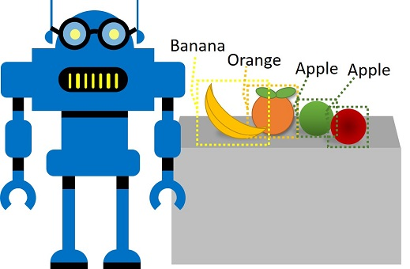

<div id="readme" class="Box-body readme blob js-code-block-container p-5 p-xl-6 gist-border-0" dir="rtl">
    <article class="markdown-body entry-content container-lg" itemprop="text"><h1><a id="user-content-كشف-الكائن" class="anchor" aria-hidden="true" href="#كشف-الكائن"><svg class="octicon octicon-link" viewBox="0 0 16 16" version="1.1" width="16" height="16" aria-hidden="true"><path fill-rule="evenodd" d="M7.775 3.275a.75.75 0 001.06 1.06l1.25-1.25a2 2 0 112.83 2.83l-2.5 2.5a2 2 0 01-2.83 0 .75.75 0 00-1.06 1.06 3.5 3.5 0 004.95 0l2.5-2.5a3.5 3.5 0 00-4.95-4.95l-1.25 1.25zm-4.69 9.64a2 2 0 010-2.83l2.5-2.5a2 2 0 012.83 0 .75.75 0 001.06-1.06 3.5 3.5 0 00-4.95 0l-2.5 2.5a3.5 3.5 0 004.95 4.95l1.25-1.25a.75.75 0 00-1.06-1.06l-1.25 1.25a2 2 0 01-2.83 0z"></path></svg></a>كشف الكائن</h1>


يعد *كشف الأشياء* أحد أشكال الرؤية الخاصة بالكمبيوتر حيث يتم تدريب نموذج تعليم الآلة على تصنيف الحالات الفردية للأشياء في صورة ما، والإشارة إلى *المربع المحيط* الذي يحدد موقعه. يمكنك التفكير في هذا على أنه تقدمٌ من *تصنيف الصور* (حيث يجيب النموذج على السؤال "ما هذه الصورة؟") إلى إنشاء حلولٍ حيث يمكننا أن نسأل النموذج "ما هي الأشياء في هذه الصورة وأين توجد؟".



على سبيل المثال ، قد يستخدم محل بقالة نموذجًا لاكتشاف الأشياء لتنفيذ نظام سداد تلقائي يقوم بمسح حزام ناقل باستخدام كاميرا، ويمكنه تحديد عناصر معينة دون الحاجة إلى وضع كل عنصر على الحزام ومسحهم ضوئيًا على حدة.

توفر خدمة **الرؤية المعدلة **المعرفية في Microsoft Azure حلًا يعمل بنظام السحابة، لإنشاء نماذج معدلة للكشف عن الأشياء ونشرها.

## إنشاء مورد رؤية معدلة

لاستخدام خدمة الرؤية المعدلة، تحتاج إلى مورد Azure، ويمكنك استخدامه لتدريب نموذج، ومورد يمكنك نشره لتستخدمه التطبيقات. يمكنك استخدام نفس المورد لكل مهمة من هذه المهام، أو يمكنك استخدام موارد مختلفة لكل منها لتخصيص التكاليف بشكل منفصلٍ، بشرط أن يتم إنشاء كلا الموردين في نفس المنطقة. يمكن أن يكون المورد لأي من المهمتين (أو لكليهما) مورد **خدمات معرفية** عام، أو مورد **رؤية معدلة** محدد. استخدم الإرشادات التالية لإنشاء مورد **رؤية معدلة** جديد (أو يمكنك استخدام مورد موجود إذا كان لديك واحدًا من قبل).

1. في مستعرضٍ جديدٍ، افتح مدخل Azure على [https://portal.azure.com](https://portal.azure.com)، وقم بتسجيل الدخول باستخدام حساب Microsoft المرتبط باشتراك Azure الخاص بك.
2. اضغط على زر **&#65291إنشاء مورد**، ابحث عن* رؤية معدلة،* وأنشئ **مورد رؤية معدلة** بالإعدادات التالية:
    - **إنشاء الخيارات**: كلاهما
    - **الاشتراك**: *اشتراكك في Azure*
    - **مجموعة الموارد**: *حدد أو أنشئ مجموعة موارد باسمٍ فريدٍ*
    - **الاسم:** *أدخل اسمًا فريدًا*.
    - **موقع التدريب**: *اختر أي منطقة متوفرة*
    - **مستوى أسعار التدريب:** F0
    - **موقع التنبؤ:** *نفس الموقع الذي يوجد به مورد التدريب*
    - **مستوى أسعار التنبؤ**: F0

    **ملاحظة**: إذا كانت لديك خدمة رؤية معدلة F0 في اشتراكك مسبقًا، فاختر **S0** لأجل هذا.

3. انتظر حتى يتم إنشاء المورد.

## قم بإنشاء مشروع رؤية مخصصة

لتدريب نموذج الكشف عن الأشياء، تحتاج إلى إنشاء مشروع رؤية معدلة بناءً على مورد التدريب الخاص بك. للقيام بذلك، ستستخدم منصة الرؤية المعدلة Custom Vision.

1. في مستعرضٍ جديدٍ، افتح مدخل Azure على [https://customvision.ai](https://customvision.ai)، وقم بتسجيل الدخول باستخدام حساب Microsoft المرتبط باشتراك Azure الخاص بك.
2. قم بإنشاء مشروع جديد بالإعدادات التالية:
    - **الاسم:** كشف البقالة
    - **الوصف:** الكشف عن الأشياء لمحلات البقالة.
    - **المورد** *مورد الرؤية المعدلة الذي أنشأته مسبقًا*
    - **أنواع المشاريع:** كشف الكائن
    - ** لمجالات**: عام
3. انتظر حتى يتم إنشاء المشروع وفتحه في المتصفح.

## أضف الصور وضع تمييزًا عليها

لتدريب نموذج كشف الأشياء، تحتاج إلى تحميل الصور التي تحتوي على الفئات التي تريد أن يحددها النموذج، وتمييزها للإشارة إلى المربعات المحيطة لكل كائن مماثل.

1. قم بتنزيل واستخراج صور التدريب من https://aka.ms/fruit-objects. يحتوي المجلد المستخرج على مجموعة من صور الفاكهة.
2. في منصة الرؤية المعدلة في مشروع الكشف عن الأشياء، اختر **إضافة الصور** وحمل جميع الصور من الملف المستخرج.
3. بعد تحميل الصور، اختر أول صورة لفتحها.
4. ضع سهم الفأرة فوق أي كائن في الصورة حتى يتم عرض المنطقة المكتشفة تلقائيًا مثل الصورة أدناه. ثم اختر هذا الكائن، وإذا لزم الأمر، قم بتغيير حجم المنطقة المحيطة به.


بدلاً من ذلك، يمكنك ببساطة السحب حول الكائن لإنشاء منطقة.

5. عندما تحيط المنطقة بالكائن، أضف وسمًا جديدًا بنوع الكائن المناسب (*تفاحة* أو *موزة* أو *برتقالة*) كما هو موضح هنا:


6. حدد كل كائن آخر في الصورة وقم بتمييزه، وغير حجم المناطق وأضف تمييزاتٍ جديدةٍ حسب الحاجة.


7. استخدم السهم** > **نحو اليمين للانتقال إلى الصورة التالية، ووضع ميزةً على الأشياء الموجودة. ثم استمر في العمل من خلال مجموعة الصور بأكملها، ووضع علامات على كل تفاحة وموز وبرتقال.

8. عندما تنتهي من وضع تمييزاتٍ على الصورة الأخيرة، أغلق محرر **تفاصيل الصورة** وفي صفحة **صور التدريب** تحت **العلامات **, اختر **الصور المعلمة** لمشاهدة جميع الصور التي تم وضع علامة عليها:


## تدريب واختبار نموذج

الآن بعد أن قمت بتمييز الصور في مشروعك، أنت جاهز لتدريب نموذجٍ.

1. في مشروع الرؤية المعدلة، فوق الصور، انقر فوق **زر التدريب** لتدريب نموذج تصنيف باستخدام الصور المعلمة. اضغط على خيار **التدريب السريع**.
2. انتظر حتى يكتمل التدريب (قد يستغرق عشر دقائق أو نحو ذلك)، ثم قم بمراجعة مقاييس أداء *الدقة* و*الاستدعاء* و*mAP*، والتي تقيس دقة التنبؤ لنموذج التصنيف، ويجب أن تكون جميعها عالية.
3. في الجزء العلوي الأيسر من الصفحة، انقر فوق **اختبار سريع**، ثم في مربع عنوان** URL للصورة**، أدخل `https://aka.ms/apple-orange` واعرض التنبؤ الذي تم إنشاؤه. ثم أغلق نافذة **الاختبار السريع**.

## انشر واستعمل نموذج الكشف عن الأشياء

أنت الآن جاهز لنشر نموذجك المدرّب واستخدامه من تطبيق عميل.

1. في أعلى يسار صفحة **الأداء**، انقر فوق** &#128504;**زر انشر لنشر النموذج المدرب بالإعدادات التالية:
    - **اسم النموذج**: كشف-انتاج
    - **مورد التنبؤ**: *مورد** **تنبؤ* الرؤية المعدلة الخاص بك.

### (!) تسجيل الوصول 
هل استخدمت نفس اسم النموذج: **detect-produce**؟ 

2. بعد النشر، انقر فوق أيقونة *الإعدادات* (&#9881;) في أعلى يمين صفحة **الأداء لعرض إعدادات المشروع**. بعد ذلك، تحت **"عام"** (على اليسار)، انسخ **رقم تعريف المشروع**. انتقل أسفل الصفحة وألصقه في خانة التعليمات البرمجية أسفل الخطوة 5 **لتحل محل YOUR_PROJECT_ID**. 

> (*إذا استخدمت مورد **الخدمات المعرفية بدلاً من إنشاء مورد ** رؤية** معدلة ** في بداية هذا التمرين، فإنه يمكنك نسخ مفتاحه ونقطة نهايته من الجانب الأيمن من إعدادات المشروع، ولصقه في خانة التعليمات البرمجية أدناه، وتشغيله لرؤية نتائجه. خلافًا لذلك، تابع إكمال الخطوات أدناه للحصول على المفتاح ونقطة النهاية لمورد توقع الرؤية المعدلة*) 

3. في الجزء العلوي الأيسر من صفحة **إعدادات المشروع**، انقر فوق أيقونة *معرض المشاريع* (&#128065;) للعودة إلى الصفحة الرئيسية لمنصة الرؤية المعدلة Custom Vision، حيث يتم إدراج مشروعك الآن.

4. في الصفحة الرئيسية لمنصة الرؤية المعدلة، في أعلى اليمين، انقر فوق رمز *الإعدادات* (&#9881;) لعرض إعدادات خدمة الرؤية المعدلة الخاصة بك. بعد ذلك، تحت **الموارد،** قم بتوسيع مورد *التنبؤ* الخاص بك (<u>وليس</u>مورد التدريب) وانسخ قيم **المفتاح** و**نقطة النهاية الخاصة به إلى خانة الرمز أسفل الخطوة 5، مع استبدال **YOUR_KEY**و **YOUR_ENDPOINT**.

### (!) تسجيل الوصول 
إذا كنت تستخدم مورد **رؤية معدلة**، فهل استخدمت مورد** التنبؤ** (<u>وليس</u> مورد التدريب)؟

5. قم بتشغيل خانة التعليمات البرمجية أدناه بالنقر فوق زر تشغيل الخلية <span>&#9655;</span> (على يسار الخلية) لتعيين المتغيرات على رقم تعريف المشروع والمفتاح ونقطة النهاية.


```python
project_id = 'YOUR_PROJECT_ID' # Replace with your project ID
cv_key = 'YOUR_KEY' # Replace with your prediction resource primary key
cv_endpoint = 'YOUR_ENDPOINT' # Replace with your prediction resource endpoint

model_name = 'detect-produce' # this must match the model name you set when publishing your model iteration exactly (including case)!
print('Ready to predict using model {} in project {}'.format(model_name, project_id))
```

يمكنك الآن استخدام المفتاح ونقطة النهاية مع عميل رؤية معدلة للاتصال بنموذج تصنيف الرؤية المعدلة الخاص بك.

قم بتشغيل خانة التعليمات البرمجية التالية، والتي تستخدم النموذج الخاص بك لاكتشاف عناصر إنتاج فردية في صورة ما.

> **ملاحظة**: لا تقلق كثيرًا بشأن تفاصيل الكود. يستخدم Python SDK لخدمة Custom Vision لإرسال صورة إلى نموذجك واسترداد تنبؤات الأشياء المكتشفة. يتكون كل توقع من اسم فئة (*تفاحة* أو *موزة* أو *برتقالة*)، وإحداثيات *المربع المحيط* التي تشير إلى مكان اكتشاف الكائن المتوقع في الصورة. ثم يستخدم الكود هذه المعلومات لرسم مربع مُسمى حول كل كائن في الصورة.


```python
from azure.cognitiveservices.vision.customvision.prediction import CustomVisionPredictionClient
from msrest.authentication import ApiKeyCredentials
from matplotlib import pyplot as plt
from PIL import Image, ImageDraw, ImageFont
import numpy as np
import os
%matplotlib inline

# حمل صورة اختبارية واحصل على أبعادها.
test_img_file = os.path.join('data', 'object-detection', 'produce.jpg')
test_img = Image.open(test_img_file)
test_img_h, test_img_w, test_img_ch = np.array(test_img).shape

# الحصول على عميل تنبؤي لنموذج الكشف على الأشياء
credentials = ApiKeyCredentials(in_headers={"Prediction-key": cv_key})
predictor = CustomVisionPredictionClient(endpoint=cv_endpoint, credentials=credentials)

print('Detecting objects in {} using model {} in project {}...'.format(test_img_file, model_name, project_id))

# كشف الكائنات في صورة الاختبار
with open(test_img_file, mode="rb") as test_data:
    results = predictor.detect_image(project_id, model_name, test_data)

# إنشاء شكل لعرض النتائج
fig = plt.figure(figsize=(8, 8))
plt.axis('off')

# عرض الصورة بمربعات حول كل كائن تم الكشف عنه
draw = ImageDraw.Draw(test_img)
lineWidth = int(np.array(test_img).shape[1]/100)
object_colors = {
    "apple": "lightgreen",
    "banana": "yellow",
    "orange": "orange"
}
for prediction in results.predictions:
    color = 'white' # default for 'other' object tags
    if (prediction.probability*100) > 50:
        if prediction.tag_name in object_colors:
            color = object_colors[prediction.tag_name]
        left = prediction.bounding_box.left * test_img_w 
        top = prediction.bounding_box.top * test_img_h 
        height = prediction.bounding_box.height * test_img_h
        width =  prediction.bounding_box.width * test_img_w
        points = ((left,top), (left+width,top), (left+width,top+height), (left,top+height),(left,top))
        draw.line(points, fill=color, width=lineWidth)
        plt.annotate(prediction.tag_name + ": {0:.2f}%".format(prediction.probability * 100),(left,top), backgroundcolor=color)
plt.imshow(test_img)

```

عرض التوقعات الناتجة، والتي تظهر الأشياء المكتشفة واحتمال كل توقع.
