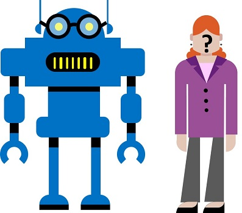

<div id="readme" class="Box-body readme blob js-code-block-container p-5 p-xl-6 gist-border-0" dir="rtl">
    <article class="markdown-body entry-content container-lg" itemprop="text"><h1><a id="user-content-كشف-وتحليل-الوجوه" class="anchor" aria-hidden="true" href="#كشف-وتحليل-الوجوه"><svg class="octicon octicon-link" viewBox="0 0 16 16" version="1.1" width="16" height="16" aria-hidden="true"><path fill-rule="evenodd" d="M7.775 3.275a.75.75 0 001.06 1.06l1.25-1.25a2 2 0 112.83 2.83l-2.5 2.5a2 2 0 01-2.83 0 .75.75 0 00-1.06 1.06 3.5 3.5 0 004.95 0l2.5-2.5a3.5 3.5 0 00-4.95-4.95l-1.25 1.25zm-4.69 9.64a2 2 0 010-2.83l2.5-2.5a2 2 0 012.83 0 .75.75 0 001.06-1.06 3.5 3.5 0 00-4.95 0l-2.5 2.5a3.5 3.5 0 004.95 4.95l1.25-1.25a.75.75 0 00-1.06-1.06l-1.25 1.25a2 2 0 01-2.83 0z"></path></svg></a>كشف وتحليل الوجوه</h1>


غالبًا ما تتطلب حلول الرؤية الخاصة بالكمبيوتر برنامج ذكاء اصطناعي (AI) لتتمكن من اكتشاف الوجوه البشرية أو تحليلها أو التعرف عليها. أو على سبيل المثال، لنفترض أن شركة البيع بالتجزئة Northwind Traders قررت إنشاء "متجر ذكي"، حيث تقوم خدمات الذكاء الاصطناعي بمراقبة المتجر لتحديد العملاء الذين يحتاجون إلى المساعدة، وتوجيه الموظفين لمساعدتهم. تتمثل إحدى طرق تحقيق ذلك في إجراء اكتشاف الوجه وتحليله - بمعنى آخر، تحديد ما إذا كان هناك أي وجوه في الصور، وإذا كان هنالك، تحليل ميزاتها.



## استخدم خدمة معرف الوجه للكشف عن الوجوه

افترض أن نظام المتجر الذكي الذي تريد شركة Northwind Traders إنشاؤه يحتاج إلى أن يكون قادرًا على اكتشاف العملاء وتحليل ميزات وجوههم. في Microsoft Azure، يمكنك استخدام **Face**، وهو جزء من خدمات Azure المعرفية للقيام بذلك.

### إنشاء مورد خدمات معرفية

لنبدأ بإنشاء مورد **خدمات معرفية** في اشتراكك في Azure.

> **ملاحظة**: إذا كان لديك بالفعل مورد خدمات معرفية، فقط افتح **صفحة البدء السريع** الخاصة به في مدخل Azure وانسخ مفتاحه ونقطة النهاية في الخانة أدناه. خلاف ذلك، اتبع الخطوات أدناه لإنشاء واحدة.

1. في علامة تبويب مستعرض أخرى، افتح مدخل Azure على https://portal.azure.com، وقم بتسجيل الدخول باستخدام حساب Microsoft الخاص بك.
2. انقر فوق **&#65291;وقم بإنشاء زر مورد** وابحث عن *خدمات معرفية*, وأنشئ مورد **خدمات معرفية** بالإعدادات التالية:
    - **الاشتراك**: *اشتراكك في Azure.*
    - **مجموعة الموارد**: *حدد أو أنشئ مجموعة موارد باسم فريد*.
    - **المنطقة**: *اختر أي منطقة متوفرة:*
    - **الاسم:** *أدخل اسمًا فريدًا*.
    - **مستوى الأسعار**: S0
    - **أؤكد أنني قد قرأت وفهمت الإخطارات**: تم الاختيار.
3. انتظر حتى اكتمال النشر. ثم انتقل إلى مورد الخدمات المعرفية الخاص بك، وفي صفحة **نظرة عامة**، انقر على رابط لإدارة مفاتيح الخدمة. ستحتاج إلى نقطة النهاية والمفاتيح للاتصال بمورد الخدمات المعرفية من تطبيقات العميل.

### احصل على المفتاح ونقطة النهاية لمورد الخدمات المعرفية

لاستخدام مورد الخدمات المعرفية، تحتاج تطبيقات العميل إلى نقطة النهاية ومفتاح المصادقة:

1. في مدخل Azure، في صفحة **المفاتيح ونقطة النهاية** لمورد الخدمة المعرفية، انسخ **Key1** لموردك وقم بلصقه في الرمز أدناه، مع استبدال **YOUR_COG_KEY**.

2. انسخ **نقطة النهاية** لموردك وألصقها في الرمز أدناه، لتحل محل **YOUR_COG_ENDPOINT**.

3. قم بتشغيل الرمز في الخانة أدناه عن طريق النقر فوق زر تشغيل الخلية <span>&#9655;</span> (في الجزء العلوي الأيسر من الخلية).


```python
cog_key = 'YOUR_COG_KEY'
cog_endpoint = 'YOUR_COG_ENDPOINT'

print('Ready to use cognitive services at {} using key {}'.format(cog_endpoint, cog_key))
```

الآن بعد أن أصبح لديك مورد خدمات معرفية، يمكنك استخدام خدمة الوجه لاكتشاف الوجوه البشرية في المتجر.

قم بتشغيل خلية التعليمات البرمجية أدناه لمشاهدة مثال.


```python
from azure.cognitiveservices.vision.face import FaceClient
from msrest.authentication import CognitiveServicesCredentials
from python_code import faces
import os
%matplotlib inline

# قم بإنشاء عميل الكشف عن الوجه.
face_client = FaceClient(cog_endpoint, CognitiveServicesCredentials(cog_key))

# إضافة صورة
image_path = os.path.join('data', 'face', 'store_cam2.jpg')
image_stream = open(image_path, "rb")

# كشف الوجوه
detected_faces = face_client.face.detect_with_stream(image=image_stream)

# اعرض الوجوه (الرمز في python_code / faces.py)
faces.show_faces(image_path, detected_faces)
```

يتم تعيين معرف فريد لكل وجه تم تحديده، بحيث يمكن للتطبيق الخاص بك تحديد كل وجه فردي تم الكشف عنه.

قم بتشغيل الخانة أدناه لرؤية المعرفات لبعض وجوه المتسوقين.


```python
# إضافة صورة
image_path = os.path.join('data', 'face', 'store_cam3.jpg')
image_stream = open(image_path, "rb")

# كشف الوجوه
detected_faces = face_client.face.detect_with_stream(image=image_stream)

# اعرض الوجوه (الرمز في python_code / faces.py)
faces.show_faces(image_path, detected_faces, show_id=True)
```

## تحليل سمات الوجه

يمكن للوجه أن يفعل أكثر بكثير من مجرد الكشف عن الوجوه. يمكنه أيضًا تحليل ملامح الوجه وتعبيراته لاقتراح العمر والحالة العاطفية؛ على سبيل المثال، قم بتشغيل الرمز أدناه لتحليل سمات وجه المتسوق.


```python
# إضافة صورة
image_path = os.path.join('data', 'face', 'store_cam1.jpg')
image_stream = open(image_path, "rb")

# كشف الوجوه وسمات الوجه المحددة
attributes = ['age', 'emotion']
detected_faces = face_client.face.detect_with_stream(image=image_stream, return_face_attributes=attributes)

# اعرض الوجوه والسمات (الرمز في python_code / faces.py)
faces.show_face_attributes(image_path, detected_faces)
```

بناءً على نتائج المشاعر المكتشفة للعميل في الصورة، يبدو أنه سعيدٌ جدًا بتجربة التسوق.

## ابحث عن وجوه متشابهة 

تُستخدم معرفات الوجه التي تم إنشاؤها لكل وجه تم كشفه لتحديد عمليات اكتشاف الوجه بشكل فردي. يمكنك استخدام هذه المعرفات لمقارنة الوجه المكتشف بالوجوه المكتشفة سابقًا، والعثور على الوجوه ذات الميزات المماثلة.

على سبيل المثال، قم بتشغيل الخانة أدناه لمقارنة المتسوق في صورة مع المتسوقين في صورة أخر، واعثر على وجه مطابق.


```python
# احصل على معرف الوجه الأول في الصورة الأولى
image_1_path = os.path.join('data', 'face', 'store_cam3.jpg')
image_1_stream = open(image_1_path, "rb")
image_1_faces = face_client.face.detect_with_stream(image=image_1_stream)
face_1 = image_1_faces[0]

# احصل على معرفات الوجه في صورة ثانية
image_2_path = os.path.join('data', 'face', 'store_cam2.jpg')
image_2_stream = open(image_2_path, "rb")
image_2_faces = face_client.face.detect_with_stream(image=image_2_stream)
image_2_face_ids = list(map(lambda face: face.face_id, image_2_faces))

# ابحث عن وجوه في الصورة 2 مشابهة لتلك الموجودة في الصورة 1
similar_faces = face_client.face.find_similar(face_id=face_1.face_id, face_ids=image_2_face_ids)

# أظهر الوجه في الصورة 1، والوجوه المتشابهة في الصورة 2 (الرمز في python_code / face.py)
faces.show_similar_faces(image_1_path, face_1, image_2_path, image_2_faces, similar_faces)
```

## التعرف على الوجوه

لقد رأيت حتى الآن أن Face يمكنه الكشف عن الوجوه وميزاته، ويمكنه تحديد وجهين متشابهين. يمكنك أن تأخذ الأمور خطوة إلى الأمام من خلال تنفيذ حل *التعرف على الوجه* الذي تقوم فيه بتدريب الوجه على التعرف على وجه شخص معين. يمكن أن يكون هذا مفيدًا في مجموعة متنوعة من الوضعيات، مثل الوسم تلقائيًا على صور الأصدقاء في أحد تطبيقات الوسائط الاجتماعية، أو استخدام التعرف على الوجه كجزء من نظام الهوية القياسية للتحقق.

لمعرفة كيفية عمل ذلك، لنفترض أن شركة Northwind Traders تريد استخدام التعرف على الوجه للتأكد من أن الموظفين المعتمدين فقط في قسم تكنولوجيا المعلومات يمكنهم الوصول إلى الأنظمة الآمنة.

سنبدأ بإنشاء *مجموعة أشخاص* لتمثيل الموظفين المرخص لهم.


```python
group_id = 'employee_group_id'
try:
    # Delete group if it already exists
    face_client.person_group.delete(group_id)
except Exception as ex:
    print(ex.message)
finally:
    face_client.person_group.create(group_id, 'employees')
    print ('Group created!')
```

الآن بعد أن وجدت *مجموعة الأشخاص*، يمكننا إضافة شخص لكل *موظف* نريد إدخاله في المجموعة، ثم تسجيل صور متعددة لكل شخص حتى يتمكن Face من التعرف على سمات الوجه المميزة لكل شخص. من الناحية المثالية، تُظهر الصور نفس الشخص في أوضاع مختلفة وبتعبيرات وجه مختلفة.

سنضيف موظفًا واحدًا اسمه ويندل، ونسجل ثلاث صور للموظف.


```python
import matplotlib.pyplot as plt
from PIL import Image
import os
%matplotlib inline

# إضافة شخص (ًهو ويندل) إلى المجموعة
wendell = face_client.person_group_person.create(group_id, 'Wendell')

# الحصول على صورة ويندل
folder = os.path.join('data', 'face', 'wendell')
wendell_pics = os.listdir(folder)

# سجل الصور
i = 0
fig = plt.figure(figsize=(8, 8))
for pic in wendell_pics:
    # Add each photo to person in person group
    img_path = os.path.join(folder, pic)
    img_stream = open(img_path, "rb")
    face_client.person_group_person.add_face_from_stream(group_id, wendell.person_id, img_stream)

    # Display each image
    img = Image.open(img_path)
    i +=1
    a=fig.add_subplot(1,len(wendell_pics), i)
    a.axis('off')
    imgplot = plt.imshow(img)
plt.show()
```

مع إضافة الشخص وتسجيل الصور، يمكننا الآن تدريب Face على التعرف على كل شخص.


```python
face_client.person_group.train(group_id)
print('Trained!')
```

الآن، مع النموذج الذي تم تدريبه، يمكنك استخدامه لتحديد الوجوه التي تم التعرف عليها في الصورة.


```python
# احصل على معرفات الوجه في صورة ثانية
image_path = os.path.join('data', 'face', 'employees.jpg')
image_stream = open(image_path, "rb")
image_faces = face_client.face.detect_with_stream(image=image_stream)
image_face_ids = list(map(lambda face: face.face_id, image_faces))

# تعرف على أسماء الوجوه
face_names = {}
recognized_faces = face_client.face.identify(image_face_ids, group_id)
for face in recognized_faces:
    person_name = face_client.person_group_person.get(group_id, face.candidates[0].person_id).name
    face_names[face.face_id] = person_name

# إظهار الوجوه المعرفة
faces.show_recognized_faces(image_path, image_faces, face_names)


```

## معرفة المزيد

لمعرفة المزيد حول خدمة Face المعرفية، راجع [مستندات Face](https://docs.microsoft.com/azure/cognitive-services/face/)

