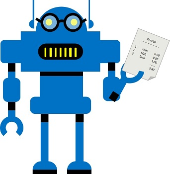

<div id="readme" class="Box-body readme blob js-code-block-container p-5 p-xl-6 gist-border-0" dir="rtl">
    <article class="markdown-body entry-content container-lg" itemprop="text"><h1><a id="user-content-تحليل-الإيصالات-باستخدام-معرف-النماذج" class="anchor" aria-hidden="true" href="#تحليل-الإيصالات-باستخدام-معرف-النماذج"><svg class="octicon octicon-link" viewBox="0 0 16 16" version="1.1" width="16" height="16" aria-hidden="true"><path fill-rule="evenodd" d="M7.775 3.275a.75.75 0 001.06 1.06l1.25-1.25a2 2 0 112.83 2.83l-2.5 2.5a2 2 0 01-2.83 0 .75.75 0 00-1.06 1.06 3.5 3.5 0 004.95 0l2.5-2.5a3.5 3.5 0 00-4.95-4.95l-1.25 1.25zm-4.69 9.64a2 2 0 010-2.83l2.5-2.5a2 2 0 012.83 0 .75.75 0 001.06-1.06 3.5 3.5 0 00-4.95 0l-2.5 2.5a3.5 3.5 0 004.95 4.95l1.25-1.25a.75.75 0 00-1.06-1.06l-1.25 1.25a2 2 0 01-2.83 0z"></path></svg></a>تحليل الإيصالات باستخدام معرف النماذج</h1>




في حقل الذكاء الاصطناعي (AI) للرؤية الحاسوبية، يشيع استخدام التعرف الضوئي على الأحرف (OCR) لقراءة المستندات المطبوعة أو المكتوبة بخط اليد. في كثير من الأحيان، يتم استخراج النص ببساطة من المستندات إلى صيغة يمكن استخدامها لمزيد من المعالجة أو التحليل.

ومن وضعيات التعرف على الأحرف الأكثر تقدمًا، استخراج المعلومات من النماذج، مثل أوامر الشراء أو الفواتير، مع فهم دلالي لما تمثله الحقول في النموذج. خدمة **التعرف على النماذج** مصممة خصيصًا لهذا النوع من مشاكل الذكاء الاصطناعي.

## عرض إيصال

في هذا المثال، ستستخدم النموذج المدمج في معرف النماذج لتحليل الإيصالات.

انقر فوق الزر **تشغيل الخانة **(&#9655;) (على يسار الخانة) أدناه لتشغيلها ومشاهدة مثال للإيصال الذي ستستخدم أداة التعرف على النماذج لتحليله.


```python
import matplotlib.pyplot as plt
from PIL import Image
import os
%matplotlib inline


# تحميل وعرض صورة إيصال
fig = plt.figure(figsize=(6, 6))
image_path = os.path.join('data', 'form-receipt', 'receipt.jpg')
img = Image.open(image_path)
plt.axis('off')
plt.imshow(img)
```

## قم بإنشاء مورد معرف النماذج

ابدأ بإنشاء مورد معرف النماذج في اشتراك Azure الخاص بك:

1. في علامة تبويب مستعرض أخرى، افتح مدخل Azure على https://portal.azure.com، وقم بتسجيل الدخول باستخدام حساب Microsoft الخاص بك.
2. اختر+** إنشاء مورد،** وابحث عن أداة* التعرف على النماذج.*
3. في قائمة الخدمات اختر ** أداة التعرف على النماذج.**
4. في شفرة **أداة التعرف على النماذج،** اختر **إنشاء**.
5. في وحدة **إنشاء**، أدخل التفاصيل التالية وحدد **إنشاء**
   - **الاسم:** اسم مميز لخدمتك
   - **الاشتراك**: اشتراكك في Azure
   - **المنطقة** أي منطقة متوفرة
   - **مستوى الأسعار**: F0
   - **مجموعة الموارد**: مجموعة الموارد الحالية التي استخدمتها سابقًا
   - **أؤكد أنني قد قرأت وفهمت الإشعار أدناه:** تم الاختيار.
6. انتظر حتى يتم إنشاء الخدمة.
7. اعرض خدمة معرف النماذج التي تم إنشاؤها حديثًا في مدخل Azure وعلى صفحة **المفاتيح ونقطة النهاية،** انسخ قيم** Key1** و**نقطة النهاية** وألصقها في خلية التعليمات البرمجية أدناه، مع استبدال **YOUR_FORM_KEY** و **YOUR_FORM_ENDPOINT**.


```python
form_key = 'YOUR_FORM_KEY'
form_endpoint = 'YOUR_FORM_ENDPOINT'

print('Ready to use form recognizer at {} using key {}'.format(form_endpoint, form_key))
```

## تحليل الإيصال

أنت الآن جاهز لاستخدام أداة التعرف على النماذج لتحليل إيصال.


```python
import os
from azure.ai.formrecognizer import FormRecognizerClient
from azure.core.credentials import AzureKeyCredential

# إنشاء عميل لخدمة معرف النماذج
form_recognizer_client = FormRecognizerClient(endpoint=form_endpoint, credential=AzureKeyCredential(form_key))

try:
    print("Analyzing receipt...")
    # Get the receipt image file
    image_path = os.path.join('data', 'form-receipt', 'receipt.jpg')

    # Submit the file data to form recognizer
    with open(image_path, "rb") as f:
        analyze_receipt = form_recognizer_client.begin_recognize_receipts(receipt=f)
    
    # Get the results
    receipt_data = analyze_receipt.result()

    # Print the extracted data for the first (and only) receipt
    receipt = receipt_data[0]
    receipt_type = receipt.fields.get("ReceiptType")
    if receipt_type:
        print("Receipt Type: {}".format(receipt_type.value))
    merchant_address = receipt.fields.get("MerchantAddress")
    if merchant_address:
        print("Merchant Address: {}".format(merchant_address.value))
    merchant_phone = receipt.fields.get("MerchantPhoneNumber")
    if merchant_phone:
        print("Merchant Phone: {}".format(merchant_phone.value))
    transaction_date = receipt.fields.get("TransactionDate")
    if transaction_date:
        print("Transaction Date: {}".format(transaction_date.value))
    print("Receipt items:")
    items = receipt.fields.get("Items")
    if items:
        for idx, item in enumerate(receipt.fields.get("Items").value):
            print("\tItem #{}".format(idx+1))
            item_name = item.value.get("Name")
            if item_name:
                print("\t - Name: {}".format(item_name.value))
            item_total_price = item.value.get("TotalPrice")
            if item_total_price:
                print("\t - Price: {}".format(item_total_price.value))
    subtotal = receipt.fields.get("Subtotal")
    if subtotal:
        print("Subtotal: {} ".format(subtotal.value))
    tax = receipt.fields.get("Tax")
    if tax:
        print("Tax: {}".format(tax.value))
    total = receipt.fields.get("Total")
    if total:
        print("Total: {}".format(total.value))

except Exception as ex:
    print('Error:', ex)

```

لاحظ أن معرف النماذج قادر على تفسير البيانات في النموذج، وتحديد عنوان التاجر ورقم الهاتف بشكل صحيح، وتاريخ ووقت المعاملة، بالإضافة إلى البنود والإجمالي الفرعي والضرائب والمبالغ الإجمالية.

## المزيد من المعلومات

لمزيد من المعلومات حول خدمة أداة التعرف على النماذج، يرجى الاطلاع على [مستندات أداة التعرف النماذج](https://docs.microsoft.com/ar-sa/azure/cognitive-services/form-recognizer/index)
