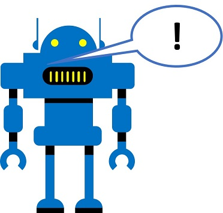

# الكلام

نتوقع أن نكون قادرين بشكل متزايد على التواصل مع أنظمة الذكاء الاصطناعي (AI) من خلال التحدث إليها، غالبًا مع توقع استجابة منطوقة.



يعد* التعرف على الكلام* (نظام ذكاء اصطناعي يفسر اللغة المنطوقة) و*اصطناع الكلام *(نظام ذكاء اصطناعي يولد استجابة منطوقة) من المكونات الأساسية لحل الذكاء الاصطناعي الذي يدعم الكلام.

## إنشاء مورد خدمات معرفية

لإنشاء برنامج يمكنه تفسير الكلام المسموع والاستجابة لفظيًا، يمكنك استخدام الخدمة المعرفية **للكلام**، والتي توفر طريقة بسيطة لتحويل اللغة المنطوقة إلى نص والعكس صحيح.

إذا لم يكن لديك واحد بالفعل، فاستخدم الخطوات التالية لإنشاء مورد **خدمات معرفية**في اشتراكك في Azure:

> **ملاحظة**: إذا كان لديك بالفعل مورد خدمات معرفية، فقط افتح صفحة** البدء السريع** الخاصة به في مدخل Azure وانسخ مفتاحه ونقطة النهاية إلى الخانة أدناه. خلاف ذلك، اتبع الخطوات أدناه لإنشاء واحدة.

1. في علامة تبويب مستعرض أخرى، افتح مدخل Azure على https://portal.azure.com، وقم بتسجيل الدخول باستخدام حساب Microsoft الخاص بك.
2. انقر فوق **&#65291;زر إنشاء مورد** وابحث عن *الخدمات المعرفية*، وأنشئ مورد **خدمات معرفية** بالإعدادات التالية:
    - **الاشتراك**: *اشتراكك في Azure.*
    - **مجموعة الموارد**: *حدد أو أنشئ مجموعة موارد باسم فريد*.
    - **المنطقة** *اختر أي منطقة متوفرة:*
    - **الاسم:** *أدخل اسمًا فريدًا*.
    - **مستوى الأسعار**: S0
    - **أؤكد أنني قد قرأت وفهمت الإخطارات**: تم الاختيار.
3. انتظر حتى اكتمال النشر. ثم انتقل إلى مورد الخدمات المعرفية الخاص بك، وفي صفحة **نظرة عامة**، انقر على رابط لإدارة مفاتيح الخدمة. ستحتاج إلى المفاتيح والموقع للاتصال بمورد الخدمات المعرفية من تطبيقات العميل.

### احصل على المفتاح والموقع لمورد الخدمات المعرفية

لاستخدام مورد الخدمات المعرفية، تحتاج تطبيقات العميل إلى مفتاح المصادقة والموقع:

1. في مدخل Azure، في صفحة **المفاتيح ونقطة النهاية** لمورد الخدمة المعرفية، انسخ **Key1** لموردك وقم بلصقه في الرمز أدناه، مع استبدال **YOUR_COG_KEY**.
2. انسخ **الموقع** لموردك والصقه في الرمز أدناه، مع استبدال**YOUR_COG_LOCATION**.
>**ملاحظة**: ابق في صفحة **المفاتيح ونقطة النهاية** وانسخ **الموقع** من هذه الصفحة (مثال: _westus_). يرجى عدم إضافة مسافات بين الكلمات في حقل الموقع. 
3. قم بتشغيل الرمز أدناه عن طريق النقر فوق الزر **تشغيل الخانة** (&#9655;) الموجود على يسار الخانة.


```python
cog_key = 'YOUR_COG_KEY'
cog_location = 'YOUR_COG_LOCATION'

print('Ready to use cognitive services in {} using key {}'.format(cog_location, cog_key))
```

## التعرف على الكلام

لنفترض أنك تريد إنشاء نظام آلية المنزل يقبل التعليمات المنطوقة، مثل "تشغيل الوضع الليلي" أو "إيقاف تشغيل الوضع الليلي". يجب أن يكون التطبيق الخاص بك قادرًا على أخذ المدخلات الصوتية (التعليمات المنطوقة الخاصة بك)، وتفسيرها عن طريق نسخها إلى نص يمكنه بعد ذلك تفكيكها وتحليلها.

أنت الآن جاهز لتدوين بعض الكلام. يمكن أن يكون الإدخال من **ميكروفون** أو **ملف صوتي**. 

### التعرف على الكلام بواسطة ميكروفون

لنجرب إدخال ميكروفون أولًا. قم بتشغيل الخانة أدناه وقل **على الفور** بصوت عالٍ "**تشغيل الوضع الليلي".** استعمل إمكانيات تحويل الكلام إلى نص في خدمة الكلام على نسخ الصوت. يجب أن يكون الإخراج كلامك في الكتابة.


```python
import os
import IPython
from azure.cognitiveservices.speech import SpeechConfig, SpeechRecognizer, AudioConfig

# تكوين أداة التعرف على الكلام
speech_config = SpeechConfig(cog_key, cog_location)

# اطلب من الطلاب أن يقولوا "تشغيل الوضع الليلي" 
speech_recognizer = SpeechRecognizer(speech_config)

# استخدم مكالمة متزامنة لمرة واحدة لكتابة الكلام
speech = speech_recognizer.recognize_once()

print(speech.text)

```

### (!) تسجيل الوصول

هل تمكنت من تشغيل الخانة وتحويل كلامك إلى نص؟ إذا كانت الخلية أعلاه لا تعطي إخراجًا نصيًا (مثال الإخراج: _ قم بتشغيل الوضع الليلي. _)، حاول تشغيل الخانة مرة أخرى وقل **على الفور** بصوت عالٍ "تشغيل الوضع الليلي".

### التعرف على الكلام مع ملف صوتي

إذا لم تقدم الخلية أعلاه إخراجًا نصيًا، فقد يكون الميكروفون غير معدٍ لقبول الإدخال. بدلًا من ذلك، قم بتشغيل الخلية أدناه لمشاهدة خدمة التعرف على الكلام تُجري **بملف صوتي** بدلًا من **إدخال الميكروفون**. 


```python
import os
from playsound import playsound
from azure.cognitiveservices.speech import SpeechConfig, SpeechRecognizer, AudioConfig

# الحصول على أمر منطوق من ملف صوتي
file_name = 'light-on.wav'
audio_file = os.path.join('data', 'speech', file_name)

# تكوين أداة التعرف على الكلام
speech_config = SpeechConfig(cog_key, cog_location)
audio_config = AudioConfig(filename=audio_file) # Use file instead of default (microphone)
speech_recognizer = SpeechRecognizer(speech_config, audio_config)

# استخدم مكالمة متزامنة لمرة واحدة لكتابة الكلام
speech = speech_recognizer.recognize_once()

# تشغيل الصوت وإظهار النص المكتوب
playsound(audio_file)
print(speech.text)
```

## اصطناع الكلام

لقد رأيت الآن كيف يمكن استخدام خدمة الكلام لتحويل الكلام إلى نص؛ لكن ماذا عن العكس؟ كيف تحوّل نصًا إلى كلام؟

حسنًا، لنفترض أن نظام التشغيل الآلي لمنزلك قد فهم أمرًا لتشغيل الوضع الليلي. قد تكون الاستجابة المناسبة هي الاعتراف بالأمر شفهيًا (بالإضافة إلى تنفيذ المهمة الموصوفة بالفعل!)


```python
import os
import matplotlib.pyplot as plt
from PIL import Image
from azure.cognitiveservices.speech import SpeechConfig, SpeechSynthesizer, AudioConfig
%matplotlib inline

# احصل على نص ليتم نطقه
response_text = 'Turning the light on.'

# تكوين تركيب الكلام
speech_config = SpeechConfig(cog_key, cog_location)
speech_synthesizer = SpeechSynthesizer(speech_config)

# تحويل النص إلى كلام
result = speech_synthesizer.speak_text(response_text)

# اعرض الصورة المناسبة 
file_name = response_text + "jpg"
img = Image.open(os.path.join("data", "speech", file_name))
plt.axis('off')
plt. imshow(img)
```

حاول تغيير متغير **response_text ** إلى *إيقاف تشغيل الوضع الليلي*. (بما في ذلك النقطة في النهاية) وتشغيل الخانة مرة أخرى لسماع النتيجة.

## معرفة المزيد

لقد رأيت مثالًا بسيطًا جدًا لاستخدام خدمة الكلام المعرفي في هذا الدفتر. يمكنك معرفة المزيد حول تحويل [الكلام إلى نص](https://docs.microsoft.com/azure/cognitive-services/speech-service/index-speech-to-text) وتحويل[ النص إلى كلام](https://docs.microsoft.com/azure/cognitive-services/speech-service/index-text-to-speech) في مستندات خدمة الكلام.
