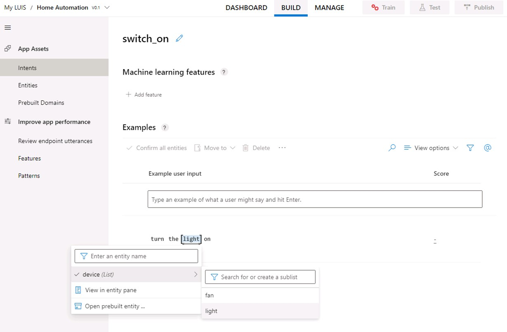

# فهم اللغة

تتزايد توقعاتنا بأن تكون أجهزة الكمبيوتر قادرة على استخدام الذكاء الصناعي لفهم الأوامر المنطوقة أو المكتوبة بلغة طبيعية. على سبيل المثال، قد ترغب في تنفيذ نظام التشغيل الآلي للمنزل الذي يمكّنك من التحكم في الأجهزة في منزلك باستخدام أوامر صوتية مثل "قم بتشغيل الضوء" أو "قم بتشغيل المروحة"، وجعل جهاز قائم على تكنولوجيا الذكاء الصناعي يفهم الأمر ويتخذ الإجراء المناسب.


## إنشاء موارد التأليف والتنبؤ

تتضمن خدمات Microsoft المعرفية خدمة فهم اللغة التي تمكنك من تحديد*الأهداف*التي يتم تطبيقها على*العناصر* بناءً على*الألفاظ*. 

لاستخدام خدمة فهم اللغة، تحتاج إلى نوعين من الموارد:

- مورد *تأليف*: يستخدم لتعريف نموذج اللغة، وتدريبه، واختباره. يجب أن يكون هذا **مورد فهم- تأليف**في اشتراك Azure الخاص بك.
- مورد *تنبؤ*: يستخدم لنشر النموذج ومعالجة الطلبات من تطبيقات العميل التي تستخدمه. بإمكان هذا أن يصبح مورد**فهم اللغة** أو**الخدمات المعرفية** في اشتراك Azure الخاص بك.

بإمكانك استخدام إما **مورد فهم اللغة** أو **الخدمات المعرفية** لنشر تطبيق *فهم اللغة*، لكن يجب إنشاء **مورد** فهم اللغة *منفصل* لتأليف التطبيق.

> **هام**: يجب إنشاء موارد التأليف في واحدة من *ثلاث مناطق* (أوروبا أو أستراليا أو الولايات المتحدة). ليس بالإمكان نشر النماذج التي تم إنشاؤها في موارد التأليف الأوروبية أو الأسترالية إلا في موارد التنبؤ في أوروبا أو أستراليا على التوالي؛ بينما يمكن نشر النماذج التي تم إنشاؤها في موارد التأليف الأمريكية لموارد التنبؤ في أي موقع Azure بخلاف أوروبا وأستراليا. راجع [وثائق مناطق التأليف والنشر](https://docs.microsoft.com/azure/cognitive-services/luis/luis-reference-regions) للحصول على تفاصيل حول مطابقة مواقع التأليف والتنبؤ.

1. في علامة تبويب مستعرض أخرى، افتح مدخل Azure على [https://portal.azure.com](https://portal.azure.com)، وقم بتسجيل الدخول باستخدام حساب Microsoft.
2. انقر فوق **+ إنشاء مورد**، وابحث عن *فهم اللغة*.
3. في قائمة الخدمات، انقر فوق **فهم اللغة**.
4. في شريط **فهم اللغة**، انقر فوق **إنشاء**.
5. في **شريط الإنشاء**، أدخل التفاصيل التالية وانقر فوق **إنشاء**
   - **خيار الإنشاء**: كلاهما
   - **الاسم**: *اسم مميز لخدمتك*
   - **الاشتراك**: *حدد اشتراك Azure الخاص بك*
   - **مجموعة الموارد**: *حدد مجموعة موارد حالية أو قم بإنشاء مجموعة جديدة*
   - **موقع التأليف**: *حدد موقعك المفضل*
   - **مستوى أسعار التأليف**: F0
   - **موقع التنبؤ**: *اختر موقعًا في نفس المنطقة ليكون موقع التأليف الخاص بك*
   - **مستوى أسعار التنبؤ**: F0
   
6. انتظر حتى يتم إنشاء الموارد، ولاحظ توفير اثنين من موارد فهم اللغة؛ واحد للتأليف، وآخر للتنبؤ. يمكنك عرض هذا من خلال الانتقال إلى مجموعة الموارد حيث قمت بإنشائها.

### إنشاء تطبيق لفهم اللغة

لتنفيذ فهم اللغة الطبيعية باستخدام فهم اللغة، يمكنك إنشاء تطبيق، ثم إضافة العناصر، والأهداف، والألفاظ لتحديد الأوامر التي تريد أن يفهمها التطبيق:

1. في علامة تبويب المستعرض الجديدة، افتح مدخل فهم اللغة لمنطقة التأليف حيث أنشأت مورد التأليف الخاص بك:
    - الولايات المتحدة: [https://www.luis.ai](https://www.luis.ai)
    - أوروبا: [https://eu.luis.ai](https://eu.luis.ai)
    - أستراليا: [https://au.luis.ai](https://au.luis.ai)

2. قم بتسجيل الدخول باستخدام حساب Microsoft المرتبط باشتراك Azure الخاص بك. إذا كانت هذه هي المرة الأولى التي تقوم فيها بتسجيل الدخول إلى بوابة فهم اللغة، فقد تحتاج إلى منح التطبيق بعض الأذونات للوصول إلى تفاصيل حسابك. ثم أكمل خطوات *الترحيب* عن طريق تحديد مورد تأليف فهم اللغة الذي أنشأته للتو في اشتراكك في Azure. 

3. افتح صفحة **تطبيقات المحادثة**، وحدد اشتراكك ومورد تأليف فهم اللغة. ثم أنشئ تطبيقًا جديدًا للمحادثة بالإعدادات التالية:
   - **الاسم**: أنظمة تحكم منزلية تلقائية
   - **ثقافة**: الإنجليزية (*إذا لم يكن هذا الخيار متاحًا، فاتركه فارغًا*)
   - **الوصف**: أنظمة تحكم منزلية تلقائية بسيطة
   - **مورد تنبؤ**: *موارد التنبؤ الخاصة بك لفهم اللغة*

4. إذا تم عرض لوحة تحتوي على نصائح حول إنشاء تطبيق فعال لفهم اللغة، فقم بإغلاقها.

### قم بإنشاء كيان

العنصر *هو الشيء* الذي يمكن لنموذج لغتك تحديده والقيام بشيء ما به. في هذه الحالة، سيتم استخدام تطبيق فهم اللغة الخاص بك للتحكم في *الأجهزة المختلفة* في المكتب، مثل الأضواء أو المراوح؛ لذلك ستنشئ *عنصرًا للجهاز* يتضمن قائمة بأنواع الأجهزة التي تريد أن يعمل التطبيق معها. لكل نوع من الأجهزة، ستنشئ قائمة فرعية تحدد اسم الجهاز (على سبيل المثال *الضوء*) وأي مرادفات يمكن استخدامها للإشارة إلى هذا النوع من الأجهزة (على سبيل المثال *المصباح*).

1. في صفحة فهم اللغة لتطبيقك، في الجزء الأيسر، انقر فوق **عناصر**. ثم انقر فوق **إنشاء**، وأنشئ عنصرًا جديدًا باسم **الجهاز**، وحدد نوع **القائمة** وانقر فوق **إنشاء**.
2. في صفحة **عناصر القائمة** ضمن **القيم الطبيعية،** اكتب **ضوء**، ثم اضغط على ENTER.
3. بعد إضافة قيمة **الضوء،** ضمن **المرادفات،** اكتب **مصباح** واضغط على ENTER.
4. أضف عنصر قائمة ثانيًا يسمى **مروحة** مع مرادف **AC**.

> **ملاحظة**: بالنسبة لهذا النشاط المعملي، استخدم الأحرف الصغيرة أو الأحرف الكبيرة بالضبط كما هو موضح _ (مثال: light **not** Light))_ ولا تضف مسافات إضافية. 

### إنشاء أهداف

الهدف *هو إجراء* تريد تنفيذه على عنصر واحد أو أكثر - على سبيل المثال، قد ترغب في تشغيل ضوء أو إيقاف تشغيل مروحة. في هذه الحالة، ستحدد هدفين: أحدهما لتشغيل الجهاز والآخر لإيقاف تشغيل الجهاز. لكل هدف، ستحدد عينات من *الألفاظ* التي تشير إلى نوع اللغة المستخدمة للإشارة إلى الهدف.

> **ملاحظة**: بالنسبة لهذا النشاط المعملي، يرجى استخدام الأحرف الصغيرة أو الأحرف الكبيرة بالضبط حسب التعليمات _ (مثال: "شغل الضوء" **وليس** "تشغيل الضوء.")_ ولا تضف مسافات إضافية. 

1. في الجزء الأيسر، انقر فوق **أهداف**. ثم انقر فوق **إنشاء**، وأضف هدفًا باسم**switch_on** وانقر فوق **تم**.
2. تحت عنوان **الأمثلة** والعنوان الفرعي **مثال إدخال المستخدم** اكتب لفظ ***شغّل الضوء*** واضغط على **Enter** لإرسال هذا اللفظ إلى القائمة.
3. عند لفظ *شغل الضوء* ، انقر فوق لفظ "ضوء"، وقم بتعيينه **كقيمة** الضوء **لعنصر** الجهاز.



4. أضف لفظًا ثانيًا إلى هدف **switch_on**، مع عبارة ***تشغيل المروحة***. ثم قم بتعيين كلمة "مروحة" **كقيمة** المروحة **لعنصر** الجهاز.
5. في الجزء الأيسر، انقر فوق **أهداف** وانقر فوق **إنشاء** أضف هدفًا ثانيًا باسم **switch_off**.
6. في صفحة **الألفاظ** لهدف **switch_off**، أضف اللفظ ***أطفئ الضوء*** وعيّن كلمة "ضوء" **لقيمة **ضوء **عنصر** الجهاز.
7. أضف لفظًا ثانيًا إلى هدف **switch_off**، مع عبارة ***أطفئ المروحة***. ثم قم بتوصيل كلمة "مروحة" إلى **قيمة** مروحة **عنصر** الجهاز.

### تدريب واختبار نموذج اللغة

أنت الآن جاهز لاستخدام البيانات التي قدمتها في شكل عناصر، وأهداف، وألفاظ، لتدريب نموذج اللغة لتطبيقك.

1. في الجزء العلوي من صفحة فهم اللغة لتطبيقك، انقر فوق **تدريب** لتدريب نموذج اللغة
2. عندما يتم تدريب النموذج، انقر فوق **اختبار**، واستخدم جزء الاختبار لعرض الهدف المتوقع للعبارات التالية:
    * *قم بتشغيل الضوء*
    * *أطفئ المروحة*
    * *أطفئ المصباح*
    * *قم بتشغيل مكيف الهواء*
3. أغلق جزء الاختبار.
    
### انشر النموذج وقم بتكوين نقاط النهاية

لاستخدام النموذج المدرَّب في تطبيق العميل، يجب عليك نشره كنقطة نهاية يمكن لتطبيقات العميل إرسال ألفاظ جديدة إليها؛ والتي من خلالها سيتم توقع الأهداف والعناصر.

1. في الجزء العلوي من صفحة فهم اللغة لتطبيقك، انقر فوق **نشر**. ثم حدد **خانة الإنتاج** وانقر فوق **تم**.

2. بعد نشر النموذج، في أعلى صفحة "فهم اللغة" لتطبيقك، انقر فوق **إدارة**. ثم في علامة تبويب **الإعدادات** قم بتدوين **هوية** تطبيقك. انسخ هذا والصقه بالترميز أدناه لاستبدال **YOUR_LU_APP_ID**.

3. في علامة تبويب **موارد Azure **، قم بتدوين **المفتاح الأساسي** وعنوان URL **لنقطة النهاية ** لمورد التنبؤ الخاص بك. انسخ هؤلاء والصقهم في الرمز أدناه، مع استبدال **YOUR_LU_KEY** و **YOUR_LU_ENDPOINT**.

4. قم بتشغيل الخلية أدناه بالنقر فوق رز **تشغيل الخلية** (&#9655;) (على يسار الخلية)، وعند المطالبة، أدخل النص *قم بتشغيل الضوء*. يتم تفسير النص من خلال نموذج فهم اللغة الخاص بك ويتم عرض الصورة المناسبة.

### **(!) هام**: 
ابحث عن الطلب في الجزء العلوي من نافذتك. ستحتاج إلى كتابة *turn the light on (قم بتشغيل الضوء)* والضغط على **إدخال**. 


```python
from python_code import luis
import matplotlib.pyplot as plt
from PIL import Image
import os
%matplotlib inline

try:
    # Set up API configuration
    luis_app_id = 'YOUR_LU_APP_ID'
    luis_key = 'YOUR_LU_KEY'
    luis_endpoint = 'YOUR_LU_ENDPOINT'

    # prompt for a command
    command = input('Please enter a command: \n')

    # get the predicted intent and entity (code in python_code.home_auto.py)
    action = luis.get_intent(luis_app_id, luis_key, luis_endpoint, command)

    # display an appropriate image
    img_name = action + '.jpg'
    img = Image.open(os.path.join("data", "luis" ,img_name))
    plt.axis('off')
    plt. imshow(img)
except Exception as ex:
    print(ex)
```

### (!) تسجيل الوصول 
هل قمت بتشغيل الخلية أعلاه، ومن ثم قمت بكتابة العبارة *تشغيل الوضع الليلي* عندما طلب منك ذلك؟ ستظهر المطالبة في الجزء العلوي من نافذتك.  

أعد تشغيل الخلية أعلاه، وحاول استخدام العبارات التالية:

* *تشغيل الخلفية الفاتحة*
* *أطفئ المصباح*
* *قم بتشغيل المروحة*
* *قم بتشغيل الضوء*
* *قم بإطفاء الضوء*
* *أطفئ المروحة*
* *قم بتشغيل مكيف الهواء*

إذا قمت بتشغيل الخلية أعلاه وعرضت صورة علامة استفهام، فربما تكون قد استخدمت نصًا أو تباعدًا مختلفًا قليلاً عما تم إرشادك إليه عند إنشاء عنصر، أو هدف، أو لفظ.

> **ملاحظة**: إذا كنت مهتمًا بالرمز المستخدم لاسترداد الأهداف والعناصر من تطبيق فهم اللغة، فابحث عن ملف **luis.py** في مجلد **python_code**.

## أضف عنصر التحكم الصوتي

حتى الآن، شاهدنا كيف نحلل النص، لكن أنظمة الذكاء الصناعي تمكّن البشر بشكل متزايد من التواصل مع خدمات البرمجيات من خلال التعرف على الكلام. لدعم ذلك، توفر خدمة **الكلام** المعرفية طريقة بسيطة لتحويل اللغة المنطوقة إلى نص.

### إنشاء مورد خدمات معرفية

إذا لم يكن لديك واحد بالفعل، فاستخدم الخطوات التالية لإنشاء مورد **خدمات معرفية** في اشتراكك في Azure:

> **ملاحظة**: إذا كان لديك بالفعل مورد خدمات معرفية، فما عليك سوى فتح صفحة **البدء السريع** الخاصة به في مدخل Azure وانسخ مفتاحه وموقعه إلى الخلية أدناه. خلاف ذلك، اتبع الخطوات أدناه لإنشاء واحدة.

1. في علامة تبويب مستعرض أخرى، افتح مدخل Azure على [https://portal.azure.com](https://portal.azure.com)، وقم بتسجيل الدخول باستخدام حساب Microsoft.
2. انقر فوق زر **&#65291; إنشاء مورد**، وابحث عن *الخدمات المعرفية،* وأنشئ مورد **خدمات معرفية** بالإعدادات التالية:
    - **الاشتراك**: *اشتراكك في Azure*.
    - **مجموعة الموارد**: *حدد أو أنشئ مجموعة موارد باسم فريد*.
    - **المنطقة**: *اختر أي منطقة متوفرة*:
    - **الاسم**: *أدخل اسمًا فريدًا*.
    - **مستوى الأسعار**: S0
    - **من خلال فحص هذا المربع، أقر بأن استخدام هذه الخدمة ليس من قبل قسم شرطة في الولايات المتحدة أو لصالحه**: تم الاختيار.
    - **أؤكد أنني قد قرأت وفهمت الإخطارات**: تم الاختيار.
3. انتظر حتى اكتمال النشر. ثم انتقل إلى مورد الخدمات المعرفية، وفي صفحة **البدء السريع،** قم بتدوين المفاتيح والموقع. ستحتاج إلى هذه للاتصال بمورد الخدمات المعرفية من تطبيقات العميل.

### احصل على المفتاح والموقع لمورد الخدمات المعرفية

لاستخدام مورد الخدمات المعرفية، تحتاج تطبيقات العميل إلى مفتاح المصادقة الخاص بها والموقع:

1. في مدخل Azure، في صفحة **المفاتيح ونقطة النهاية** لمورد الخدمة المعرفية، انسخ **Key1** لموردك وقم بلصقه في الرمز أدناه، مع استبدال **YOUR_COG_KEY**.
2. انسخ **الموقع** لموردك والصقه بالترميز أدناه، مع استبدال **YOUR_COG_LOCATION**.
>**ملاحظة**: ابق في صفحة **المفاتيح ونقطة النهاية** وانسخ **الموقع** من هذه الصفحة (مثال: _westus_). يرجى عدم إضافة مسافات بين الكلمات في حقل الموقع. 
3. قم بتشغيل الرمز في الخلية أدناه. 


```python
cog_key = 'YOUR_COG_KEY'
cog_location = 'YOUR_COG_LOCATION'

print('Ready to use cognitive services in {} using key {}'.format(cog_location, cog_key))
```

الآن قم بتشغيل الخلية أدناه لنقل الكلام من ملف صوتي، واستخدمه كأمر لتطبيق فهم اللغة الخاص بك.


```python
import os
from python_code import luis
from azure.cognitiveservices.speech import SpeechConfig, SpeechRecognizer, AudioConfig
from playsound import playsound
import matplotlib.pyplot as plt
from PIL import Image
%matplotlib inline

try:   

    # Get spoken command from audio file
    file_name = 'light-on.wav'
    audio_file = os.path.join('data', 'luis', file_name)

    # Configure speech recognizer
    speech_config = SpeechConfig(cog_key, cog_location)
    audio_config = AudioConfig(filename=audio_file) # Use file instead of default (microphone)
    speech_recognizer = SpeechRecognizer(speech_config, audio_config)

    # Use a one-time, synchronous call to transcribe the speech
    speech = speech_recognizer.recognize_once()

    # Get the predicted intent and entity (code in python_code.home_auto.py)
    action = luis.get_intent(luis_app_id, luis_key, luis_endpoint, speech.text)

    # Get the appropriate image
    img_name = action + '.jpg'

    # Play audio 
    playsound(audio_file)

    # Display image 
    img = Image.open(os.path.join("data", "luis" ,img_name))
    plt.axis('off')
    plt. imshow(img)

except Exception as ex:
    print(ex)
```

حاول تعديل الخلية أعلاه لاستخدام ملف الصوت **light-off.wav**.

## معرفة المزيد

تعرف على المزيد حول فهم اللغة في [مستندات الخدمة](https://docs.microsoft.com/azure/cognitive-services/luis/)
