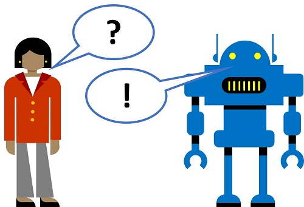

# الذكاء الاصطناعي التحادثي

فكر في عدد المرات التي تتواصل فيها مع أشخاصٍ آخرين من خلال المراسلة الفورية أو وسائل التواصل الاجتماعي، أو إرسال البريد الإلكتروني أو تقنيات أخرى عبر الإنترنت. بالنسبة للكثيرين منا؛ فإن هذا هو نموذج الاتصال الذي نختاره. عندما يكون لديك سؤال في العمل، فإنه يمكنك التواصل مع زميل باستخدام رسالة دردشة، والتي يمكنك استخدامها على الأجهزة المحمولة، بحيث تبقى دائمًا على اتصال.



الروبوتات هي بمثابة وكلاء الذكاء الاصطناعي يتواصلون باستخدام هذه الأنواع من القنوات، مما يتيح تفاعلاً تحادثيًا طبيعيًا مع خدمات البرامج.

## إنشاء قاعدة معارف عبر خدمة QnA Maker

بالنسبة لسيناريوهات دعم العملاء؛ فمن الشائع إنشاء روبوت يمكنه تفسير الأسئلة المتداولة والإجابة عليها من خلال نافذة الدردشة على موقع الويب أو البريد الإلكتروني أو الواجهة الصوتية. توجد قاعدة معارف للأسئلة والأجوبة المناسبة، والتي يمكن أن يبحث فيها الروبوت عن ردودٍ مناسبة.

خدمة QnA Maker هي خدمة معرفية في Azure تتيح لك إنشاء قاعدة معارف بسرعة، إما عن طريق إدخال أزواج من الأسئلة والأجوبة أو من مستند موجود أو صفحة ويب. يمكن لهذه الخدمة استخدام بعض إمكانيات معالجة اللغة الطبيعية الشاملة لتفسير الأسئلة، والعثور على الأجوبة المناسبة.

1. افتح علامة تبويب مستعرض أخرى وانتقل إلى مدخل QnA Maker على https://qnamaker.ai. قم بتسجيل الدخول باستخدام حساب Microsoft المرتبط باشتراك Azure الخاص بك.
2. في مدخل QnA Maker؛ حدد **إنشاء قاعدة معارف**.
3. إذا لم تكن قد أنشأت مورد خدمة سين وجيم مسبقًا، فحدد خدمة **إنشاء خدمة سين وجيم**. سيتم فتح مدخل Azure في علامة تبويب أخرى حتى تتمكن من إنشاء خدمة QnA Maker في اشتراكك. استخدم الإعدادات التالية:
   - **(معاينة) مُدارة**: غير محدد. 
   - **الاشتراك**: *اشتراكك في Azure*
   - **مجموعة الموارد**: *حدد مجموعة موارد حالية أو قم بإنشاء مجموعة جديدة*
   - **الاسم**: *اسم مميز لمورد سين وجيم الخاص بك*
   - **مستوى الأسعار**: F0
   - **مستوى الأسعار الخاص ببحث Azure**: F
   - **موقع بحث Azure**: *أي موقعٍ متاح*
   - **اسم التطبيق**: _نفس **الاسم** (سيتم إلحاق ".azurewebsites.net" تلقائيًا)_
   - **الموقع الخاص بموقع الويب**: _نفس **موقع بحث Azure**_
   - **رؤى التطبيقات**: تعطيل

> **ملاحظة**: إذا كنت قد قدمت موارد مستوى مجاني من **QnA Maker** أو** بحث Azure** فربما لن تسمح لك حصتك بإنشاء واحدٍ آخر. في هذه الحالة، قم بتحديد مستوى آخر غير**F0** / **F**.

4. انتظر حتى يكتمل نشر خدمة سين وجيم والموارد ذات الصلة في مدخل Azure.
5. ارجع إلى علامة تبويب مدخل QnA Maker **في قسم** الخطوة الثانية؛ انقر على **تحديث** لتحديث قائمة موارد خدمة سين وجيم المتاحة.
6. قم بتوصيل خدمة سين وجيم الخاصة بك بالقاعدة معارفك، عن طريق تحديد الخيارات التالية:
  - **معرف دليل Microsoft Azure**: *معرف دليل Azure لاشتراكك*
  - **اسم اشتراك Azure**: *اشتراكك في Azure*
  - **خدمة سين وجيم الخاصة بـ Azure**: *مورد خدمة سين وجيم الذي قمت بإنشائه في الخطوة السابقة*
  - **اللغة**: الإنجليزية

### (!) تسجيل الوصول
إذا تم عرض رسالة تفيد بأن الدور ليس لديه إذن لتنفيذ الإجراء الذي قد تم عرضه؛ فقم بتحديث صفحة المستعرض لمدخل QnA Maker.

7. في قسم الخطوة**الثالثة** قم بإدخال اسم **Margie's Travel KB**.
8. في قسم الخطوة**الرابعة**، في مربع **URL** قم بكتابة <a href=''>*https://github.com/MicrosoftDocs/ai-fundamentals/raw/master/data/qna_bot/margies_faq.docx*</a> ثم انقر على **+إضافة URL**. ثم ضمن **محادثات تلقائية**، اختر**مهنيّة**.
9. في قسم الخطوة**الخامسة** انقر على إنشاء **قاعدة معارفك**.
10. انتظر لمدة دقيقة أو نحو ذلك، بينما يتم إنشاء قاعدة معارفك. ثم راجع الأسئلة والإجابات التي تم استيرادها من مستند الأسئلة الشائعة، والاستجابات المحددة مسبقًا للمحادثة التلقائيّة الاحترافية.

## تحرير قاعدة المعارف

تستند قاعدة المعارف إلى التفاصيل الموجودة في مستند الأسئلة الشائعة وبعض الردود المحددة مسبقًا. يمكنك إضافة أزواج مخصصة من الأسئلة والأجوبة لتكملة هذه الأزواج.

1. انقر على **+إضافة زوجٍ من سين وجيم**.
2. في مربع **السؤال** اكتب `Hello`. ثم انقر على **+ إضافة صياغة بديلة**واكتب `Hi`.
3. في مربع**الإجابة** اكتب "مرحبًا".

## تدريب واختبار قاعدة المعارف

الآن، وبعد أن أصبحت لديك قاعدة معارف؛ فإنه يمكنك اختبارها في مدخل QnA Maker.

1. في الجزء العلوي الأيسر من الصفحة؛ انقر فوق **حفظ وتدريب** لتدريب قاعدة المعارف. قد تحتاج إلى تكبير نافذتك لرؤية الزر.
2. بعد الانتهاء من التدريب؛ قم بالنقر على **← اختبار** لفتح خانة الاختبار.
3. في جزء الاختبار، أدخل في الجزء السفلي رسالة تقول *أهلًا*. يجب أن يتم الاستجابة لقولك **مرحبًا**.
4. في جزء الاختبار بالأسفل؛ أدخل الرسالة*أريد حجز رحلة*. يجب أن تتلقى الاستجابة المناسبة من الأسئلة الشائعة.
5. عندما تنتهي من اختبار قاعدة المعارف؛ انقر على **→ اختبار** لأجل إغلاق جزء الاختبار.

## إنشاء روبوت لقاعدة المعارف

توفر قاعدة المعارف خدمة جارية بالخلفية يمكن لتطبيقات العميل استخدامها للإجابة على الأسئلة، عبر نوعٍ ما من واجهة المستخدم. عادةً ما تكون تطبيقات العميل هذه عبارة عن برامج روبوت. لتوفير قاعدة المعارف للروبوت، فيجب عليك نشرها كخدمةٍ يمكن الوصول إليها عبر HTTP. يمكنك بعد ذلك استخدام خدمة روبوت Azure، وذلك لإنشاء واستضافة روبوت يستخدم قاعدة المعارف للإجابة على أسئلة المستخدم.

1. في الأعلى من صفحة إنشاء سين وجيم، قم بالنقر على **نشر**. ثم في صفحة **Margies Travel KB** انقر على **على نشر**.
2. ثم بعد نشر الخدمة؛ انقر على**إنشاء روبوت**. يؤدي هذا إلى فتح مدخل Azure في علامة تبويب مستعرض جديدة، وذلك حتى تتمكن من إنشاء روبوت تطبيق الويب في اشتراك Azure الخاص بك.
3. في بوابة Azure؛ قم بإنشاء روبوت تطبيق الويب عبر الإعدادات التالية (سيتم ملء معظمها مسبقًا لك):
  - **معالجة الروبوت**: *اسم مميز للروبوت الخاص بك*
  - **الاشتراك**: *اشتراكك في Azure*
  - **مجموعة الموارد**: *مجموعة الموارد التي تحتوي على مورد QnA Maker الخاص بك*
  - **الموقع**: *نفس موقع خدمة QnA Maker الخاصة بك*.
  - **مستوى الأسعار**: F0
  - **اسم التطبيق**: *نفس الأمر في **معالجة الروبوت** مع إلحاق *.azurewebsites.net*بشكل تلقائي.
  - **لغة SDK**: *اختر إما C# أو Node.js*
  - **مفتاح مصادقة سين وجيم**: *يجب أن يتم تعيين هذا بشكل تلقائي على مفتاح المصادقة لقاعدة معارف سين وجيم الخاصة بك*
  - **خطة وموقع خدمة التطبيق**: *يجب أن يتم تعيين هذا بشكل تلقائي على خطة وموقع مناسبين*
  - **رؤى التطبيق**: إيقاف التشغيل
  - **معرّف برنامج Microsoft وكلمة المرور**: إنشاء معرّف البرنامج وكلمة المرور تلقائيًا.
4. انتظر حتى يتم إنشاء الروبوت الخاص بك. (ستتحرك أيقونة الإشعار في الجزء العلوي الأيمن، والذي يشبه الجرس، أثناء الانتظار). ثم في الإشعار الذي يفيد بأن النشر قد اكتمل؛ قم بالنقر على**الانتقال إلى المورد** (أو قم بالنقر، بدلًا من ذلك؛ في الصفحة الرئيسية على**مجموعات المورد،* قم بفتح مجموعة المورد حيث سبق أن قمت بإنشاء روبوت تطبيق الويب، ثم انقر عليها.)
5. في شفرة الروبوت الخاص بك؛ اعرض **الاختبار في صفحات دردشة الويب**وانتظر حتى يقوم الروبوت بعرض الرسالة**أهلًا ومرحبًا!** (قد يستغرق الأمر بضع ثوان للتهيئة).
6. استخدم واجهة الدردشة التجريبية، للتأكد من أن الروبوت الخاص بك يجيب عن الأسئلة من قاعدة المعارف الخاصة بك حسب المتوقع. على سبيل المثال؛ جرب أن تقوم بإدخال*أريد إلغاء حجزي الفندقي*.

## الوصول إلى الروبوت من خلال قناة

يمكن استخدام الروبوت لتوفير واجهة للمستخدمين من خلال قناة واحدة*أو المزيد من القنوات*. على سبيل المثال؛ يمكن أن يدعم الروبوت نفسه التفاعلات من خلال واجهة الدردشة على الويب والبريد الإلكتروني وMicrosoft Teams.

1. في مدخل Azure، وفي شفرة الروبوت الخاص بك؛ قم بعرض صفحة**القنوات** .
2. لاحظ أنه قد تم الإعلان عن قناة**دردشة عبر الويب** بشكل تلقائي، وأن بقية القنوات الخاصة بمنصات الاتصال الشائعة متوفرة أيضًا.
3. بجوار قناة **دردشة عبر الويب** انقر على **تعديل**. وهذا يفتح صفحة بالإعدادات التي تحتاجها لتضمين الروبوت الخاص بك في صفحة ويب. لتضمين الروبوت الخاص بك، فإنك تحتاج إلى رمز تضمين HTML المقدم، بالإضافة إلى أحد المفاتيح السرية التي تم إنشاؤها للروبوت الخاص بك.
4. قم بنسخ**التعليمة البرمجية المضمنة** ثم قم بلصقها في الخلية بالأسفل، مع تبديل التعليق `<!-- EMBED CODE GOES HERE -->`.
5. انقر**إظهار** لواحدٍ من مفاتيحك السرية (لا يهم أي واحد)، ثم قم بنسخه. ثم قم بلصقه في التعليمة البرمجيةHTML المضمنة أدناه، مع استبدال "YOUR_SECRET_HERE".
6. قم بتغيير **قيمة الحد الأدنى للارتفاع** في التعليمة البرمجية HTML إلى **200 بكسل**، وذلك بدلاً من القيمة المعتادة والمقدرة بـ 500 بكسل. سيساعد هذا في ضمان أن واجهة HTML مرئية بدون مرور عليها.
7. قم بتشغيل الخلية أدناه عبر النقر على الزر**تشغيل الخلية** (&#9655;) وهو رز موجود على اليسار في الخلية، وذلك لتقديم الـ HTML.
8. خلال واجهة دردشة HTML؛ قم باختبار الروبوت عن طريق إرسال سؤال يقول *من هو Margie؟* أو *ما هي الوجهات التي بإمكاني أن أصل إليها؟* (عن القيام بتهيئة الروبوت، فقد يقوم بالاستجابة لك عبر الرسالة التي تقول *أهلًا ومرحبًا* وذلك بالإضافة إلى إجابة سؤالك.).


```python
%%html

<!-- EMBED CODE GOES HERE -->
```

التجربة مع الروبوت. من المحتمل أن تجد أنه يمكنه الإجابة على الأسئلة الواردة في الأسئلة الشائعة بدقةٍ تامةٍ، ولكنه سوف يمتلك قدرة محدودة على تفسير الأسئلة التي لم يتم تدريبه عليها. يمكنك دائمًا استخدام مدخل QnA Maker لتحرير قاعدة المعارف، لتحسينها ولإعادة نشرها.

## معرفة المزيد

- لمعرفة المزيد حول خدمة QnA Maker، قم بالاطلاع على [مستندات QnA Maker](https://docs.microsoft.com/azure/cognitive-services/qnamaker/).
- لمعرفة المزيد حول خدمة روبوت Microsoft، قم بالاطلاع على [صفحة خدمة روبوت Azure](https://azure.microsoft.com/services/bot-service/).
