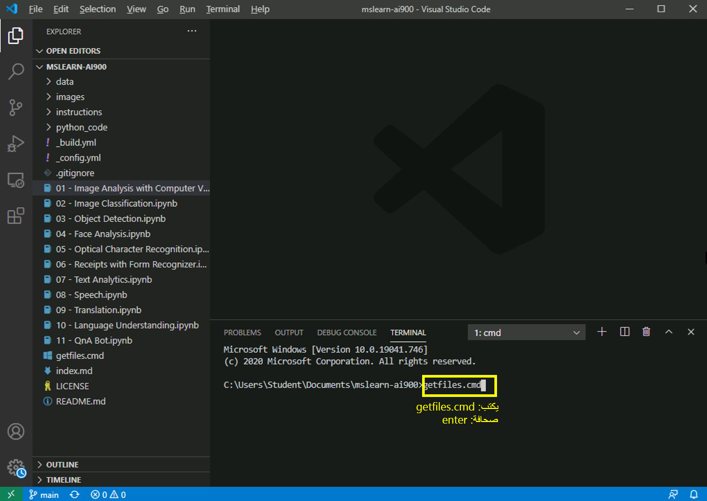

    <article class="markdown-body entry-content container-lg" itemprop="text"><table>
  <thead>
  <tr>
  <th>lab</th>
  </tr>
  </thead>
  <tbody>
  <tr>
  <td>
<table>
  <thead>
  <tr>
  <th>title</th>
  </tr>
  </thead>
  <tbody>
  <tr>
  <td>
تحليل النص
</td>
  </tr>
  </tbody>
</table>

</td>
  </tr>
  </tbody>
</table>

# أنشطة معملية للذكاء الاصطناعي AI-900
## احصل على أحدث الملفات

1.  ابدأ تشغيل تعليمة Visual Studio برمجية (أيقونة البرنامج مثبتة في شريط المهام السفلي). عند فتحه، يجب أن ترى مشروع MSLEARN-AI900 على اللوحة اليسرى.

2.  سنقوم بسحب الإصدار الأحدث من المشروع. في نوع الوحدة الطرفية المفتوحة، اكتب +++ getfiles.cmd+++ثم اضغط على **إدخال**. يقوم هذا الأمر بسحب أحدث إصدار من المشروع إلى مجلدك. 
3.  بمجرد تشغيل الأمر، يمكنك إغلاق اللوحة الطرفية. الآن يمكنك أن تبدأ النشاط المعملي. 

سوف ننشئ في هذا النشاط المعملي تطبيقًا يمكنه فهم اللغة.

-  افتح دفتر ملاحظات **07 - Text Analytics.ipynb** في تعليمة Visual Studio برمجية.
    **ملاحظة:** قد يُطلب منك إتمام استطلاع مدته دقيقتان. اذهب مباشرة وحدد **كلا، شكرًا**. قد تحتاج إلى القيام بذلك أكثر من مرة.
-  اتبع الإرشادات الموجودة في دفتر الملاحظات لإكمال النشاط المعملي.
